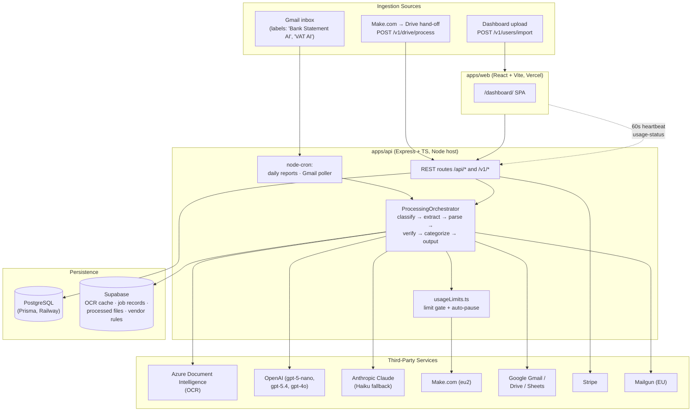
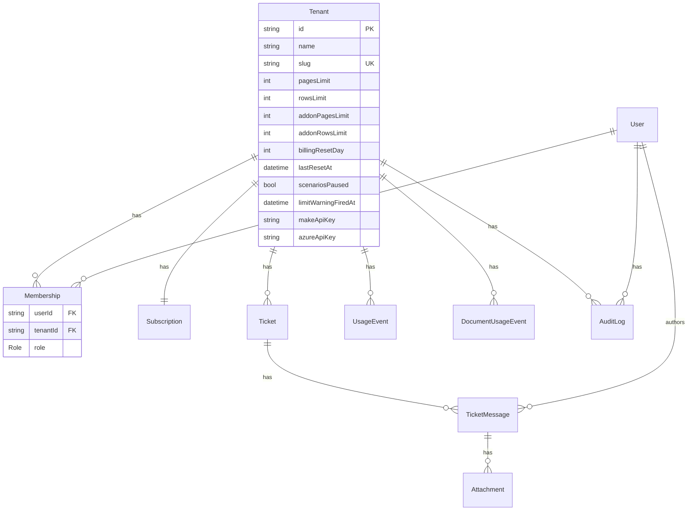
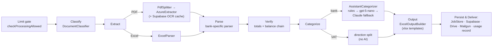

# Acctos AI — Full Technical Documentation

> **Audience:** Engineers, technical stakeholders, and future maintainers.
> **Scope:** The complete Acctos AI platform — architecture, data model, backend API, frontend, the document-processing pipeline, integrations, billing, deployment, and configuration.
> **Last updated:** 2026-07-23

---

## Table of Contents

1. [Overview](#1-overview)
2. [System Architecture](#2-system-architecture)
3. [Repository Structure](#3-repository-structure)
4. [Technology Stack](#4-technology-stack)
5. [Backend API](#5-backend-api)
6. [Data Model](#6-data-model)
7. [Frontend Web App](#7-frontend-web-app)
8. [The Document Processing Pipeline](#8-the-document-processing-pipeline)
9. [Integrations](#9-integrations)
10. [Billing & Usage Enforcement](#10-billing--usage-enforcement)
11. [Multi-Tenancy & Security](#11-multi-tenancy--security)
12. [Configuration & Environment Variables](#12-configuration--environment-variables)
13. [Local Development](#13-local-development)
14. [Deployment](#14-deployment)
15. [Known Issues & Technical Debt](#15-known-issues--technical-debt)
16. [Appendix A — API Endpoint Reference](#appendix-a--api-endpoint-reference)
17. [Appendix B — Supported Banks](#appendix-b--supported-banks)

---

## 1. Overview

**Acctos AI** is a multi-tenant SaaS platform that automates the processing of financial documents — primarily **UK bank statements** and **VAT documents** — for accounting firms and their clients. It ingests documents (via email, dashboard upload, or a Make.com/Google Drive hand-off), runs them through an OCR + AI extraction and categorization pipeline, and produces standardized Excel output that is emailed back and archived to Google Drive.

The platform has two faces:

- **A client-facing dashboard** (`apps/web`) mounted at `/dashboard/`, where clients view usage analytics, manage billing/subscriptions, upload documents, manage users, and raise support tickets.
- **A backend API + processing engine** (`apps/api`) that runs the document pipeline, tracks usage, enforces billing limits, and orchestrates all third-party integrations.

> **Note on documentation drift:** The original `README.md`, `DOCUMENTATION.md`, and `WALKTHROUGH.md` describe the project as primarily a "usage dashboard." The system has since evolved into a **document-processing platform** whose dashboard is one of several surfaces. This document reflects the current reality of the codebase. `docs/06_Client_Guide_New_System.md` (Bulgarian, v2.0) is the most up-to-date client-facing description; `WALKTHROUGH.md` is stale.

---

## 2. System Architecture

Acctos AI is a **monorepo** (npm workspaces) with two deployable apps plus a shared types package. There is no message queue — document processing runs **in-process** using an in-memory job store plus fire-and-forget async promises, with Supabase providing durable job records and file storage.



### Three processing entry points converge on one orchestrator

1. **Dashboard upload** — `POST /v1/users/import` (multipart, admin-gated).
2. **Email ingestion** — Gmail poller / Pub-Sub push detects labeled unread messages with attachments.
3. **Make.com / Drive hand-off** — `POST /v1/drive/process` receives a Drive link + target Google Sheet ID.

All three call into `ProcessingOrchestrator` (`startProcessingJob` for a single file, `startBatchProcessingJob` for multiple).

---

## 3. Repository Structure

Native **npm workspaces** monorepo (`@acctos-ai/root`). No Turbo/Nx/Lerna/pnpm — orchestration is npm workspaces + `concurrently`. `package-lock.json` at root confirms npm.

```
d:\Shiz\Acctos AI\
├── apps\
│   ├── api\                     @acctos-ai/api — Express/TS backend + processing engine
│   │   ├── prisma\              schema.prisma, migrations\ (7), seed.ts, seed-demo.ts
│   │   ├── src\
│   │   │   ├── index.ts         server entry point
│   │   │   ├── cron\            dailyReports.ts, gmailPoller.ts
│   │   │   ├── lib\             prisma.ts (singleton client)
│   │   │   ├── middleware\      auth, apiKey, hmac, superadmin, errorHandler
│   │   │   ├── prompts\         transaction-categorizer-system.txt
│   │   │   ├── routes\          13 route files (see §5)
│   │   │   ├── services\
│   │   │   │   ├── processing\  the pipeline: orchestrator, extractors, parsers\ (30 banks)
│   │   │   │   ├── google\      GmailService, GoogleService
│   │   │   │   ├── MailgunService.ts, SupabaseService.ts
│   │   │   ├── types\           express.d.ts (rawBody augmentation)
│   │   │   └── utils\           makeSync, reportGenerator, roles, usageLimits
│   │   └── (ad-hoc test-*.ts / *.mjs dev harness scripts at root)
│   └── web\                     @acctos-ai/web — React + Vite frontend
│       ├── src\
│       │   ├── App.tsx, main.tsx, index.css
│       │   ├── components\      Layout.tsx, ErrorBoundary.tsx
│       │   ├── context\         AuthContext.tsx, LanguageContext.tsx
│       │   └── pages\           LandingPage, Dashboard, Billing, Tickets, Users, ImportFile, SuperAdmin
│       └── vercel.json, vite.config.ts, .env (VITE_SUPERADMIN_EMAIL)
├── packages\
│   └── types\                   shared TS types (package name "types")
├── supabase\
│   └── migrations\              001_processing_tables, 002_add_summary_column, 003_vendor_categories
├── docs\                        01–06 (.md + generated .pdf); this file is 00
├── docker-compose.yml           local Postgres 15 only
├── package.json, tsconfig.json, README.md, DOCUMENTATION.md, WALKTHROUGH.md
```

### Root scripts

| Script | Action |
|---|---|
| `npm run dev` | Runs api + web concurrently |
| `npm run dev:api` / `dev:web` | Individual apps |
| `npm run build` | Builds api then web |
| `npm run db:generate` / `db:push` / `db:migrate` / `db:studio` | Prisma (delegated to `apps/api`) |
| `npm run docker:up` / `docker:down` | Local Postgres container |
| `npm run start:project` | `docker:up && db:push && dev` — one-command startup |

---

## 4. Technology Stack

| Layer | Technology |
|---|---|
| **Language** | TypeScript 5.3 (ESM throughout) |
| **Backend** | Node.js, Express 4, run via `tsx` (dev) / compiled `tsc` (prod) |
| **Frontend** | React 18.2, Vite 5, React Router 6 |
| **ORM / DB** | Prisma 5 + PostgreSQL (hosted on Railway) |
| **Aux storage** | Supabase (OCR cache, job records, processed files, vendor-category rules) |
| **OCR** | Azure Document Intelligence (`prebuilt-layout`) |
| **AI** | OpenAI (`gpt-5-nano` categorizer, `gpt-5.4` reports, `gpt-4o` Excel schema) + Anthropic Claude (`claude-haiku-4-5` fallback) |
| **Automation** | Make.com (eu2 region) |
| **Google** | Gmail, Drive, Sheets (OAuth2 + Pub/Sub push) |
| **Payments** | Stripe (Checkout links + Billing Portal + webhooks) |
| **Email** | Mailgun (EU region) |
| **Scheduling** | `node-cron` + `setInterval` (in-process) |
| **Charts / Icons** | Recharts, lucide-react |
| **HTTP client (web)** | axios (relative URLs, global bearer header) |
| **Testing** | Vitest (one committed unit test; many ad-hoc harness scripts) |

---

## 5. Backend API

### 5.1 Server entry point — `apps/api/src/index.ts`

- **Express 4**, port `PORT || 5000`.
- **CORS:** `app.use(cors())` — wide open, no allow-list configured (see [Known Issues](#15-known-issues--technical-debt)).
- **Body parsing:** `express.json()` with a `verify` hook that stashes the raw request buffer on `req.rawBody` — this powers **HMAC verification** (event ingestion) and **Stripe signature verification**.
- **Prisma injection:** a single client (`lib/prisma.ts`) is attached to `app.locals.prisma`; routes read `req.app.locals.prisma`.
- **Health checks:** `GET /health` and `GET /v1/health` return `{status, commit, startedAt, timestamp}`. Commit resolved from `GIT_COMMIT` env or `git rev-parse --short HEAD`.
- **Startup sequence:** mount routes → `startDailyReportCron` → `startGmailPollerCron` → `initGmailWatch` → error handler → SIGTERM handler (disconnects Prisma) → `app.listen`.

### 5.2 Route mounting

| Mount | Router file | Auth |
|---|---|---|
| `/api/auth` | `auth.ts` | JWT (mixed) |
| `/api/usage` | `documentUsage.ts` | API key (`X-API-Key`) |
| `/v1/events` | `events.ts` | HMAC |
| `/v1/usage` | `usage.ts` | JWT (+admin) |
| `/v1/users` | `users.ts` | JWT + admin |
| `/v1/tickets` | `tickets.ts` | JWT |
| `/v1/billing` | `billing.ts` | JWT (+admin for ops) |
| `/v1/integrations` | `integrations.ts` | JWT |
| `/v1/reports` | `reports.ts` | JWT (+admin) |
| `/v1/processing` | `processing.ts` | JWT + admin |
| `/v1/superadmin` | `superadmin.ts` | Superadmin secret |
| `/v1/drive` | `driveProcess.ts` | API key |
| `/v1/gmail` | `gmailWebhook.ts` | Pub/Sub |

A full endpoint listing is in [Appendix A](#appendix-a--api-endpoint-reference).

### 5.3 Middleware (`apps/api/src/middleware/`)

- **`auth.ts`** — `authenticateToken` verifies a Bearer JWT with `JWT_SECRET` (default `'secret'`) and sets `req.user = {id, email, tenantId}`. `requireRole(...roles)` looks up the `Membership` for `(userId, tenantId)` and enforces the role set.
- **`apiKey.ts`** — `verifyApiKey` checks `X-API-Key` against `USAGE_API_KEY`.
- **`hmac.ts`** — `verifyHmacSignature` computes `sha256` HMAC over `req.rawBody` with `HMAC_SECRET`, compared with `timingSafeEqual`.
- **`superadmin.ts`** — `requireSuperAdmin` checks `x-superadmin-secret` against `SUPERADMIN_SECRET` (returns 503 if the secret is unset server-side).
- **`errorHandler.ts`** — normalizes errors to `{error:{message,code}}`; only logs status ≥ 500. `createError(message, statusCode, code)` factory.
- **Roles** (`utils/roles.ts`): `ADMIN_ROLES = ['ORG_OWNER','ADMIN']`, `USER_ROLES = ['MEMBER']`.

There is **no generic HTTP rate limiter**. Throttling exists only for outbound Claude calls (5 RPM sliding window) and the usage-based scenario pausing.

### 5.4 Cron & background jobs

All started at boot in `index.ts`:

1. **Daily report cron** (`cron/dailyReports.ts`) — `node-cron` `'0 0 * * *'`, timezone **Europe/Athens**. Per tenant: sync Make.com usage, then generate an AI daily report for yesterday (OpenAI `gpt-5.4`), upserting `DailyReport`. Zero-activity days are skipped.
2. **Gmail poller** (`cron/gmailPoller.ts`) — `setInterval` fallback: every **5 min** when `PUBSUB_TOPIC` is set, else every **30 s**. Watches labels **"Bank Statement AI"** and **"VAT AI"** for unread messages with attachments.
3. **Gmail watch** (`initGmailWatch`) — when `PUBSUB_TOPIC` is set, registers a Gmail `watch` on INBOX and renews every **6 days** (watch expires at 7).
4. **JobStore cleanup** — `setInterval` every 30 min drops in-memory jobs older than 2 h.
5. **Claude rate-limit queue** — runtime sliding-window scheduler in `AssistantCategorizer`.

No external queue (no Bull/Redis).

---

## 6. Data Model

**PostgreSQL** via Prisma (`apps/api/prisma/schema.prisma`). Shared-database, shared-schema, **row-level multi-tenancy** keyed on the tenant. No Postgres RLS — isolation is enforced entirely in application code via the JWT `tenantId` + membership checks.



### 6.1 Core models

- **`Tenant`** — the central anchor. Holds integration credentials (`azureApiKey`, `azureEndpoint`, `makeApiKey`, `makeOrgId`, `makeFolderId`), billing limits (`pagesLimit`/`rowsLimit` default 1000, `addonPagesLimit`/`addonRowsLimit` default 0), billing period control (`billingResetDay` default 4, `lastResetAt`), and pause state (`scenariosPaused`, `limitWarningFiredAt`).
- **`User`** — email (unique), name, bcrypt password. **Has no direct `tenantId`** — belongs to tenants only through `Membership`, so one account can span multiple tenants.
- **`Membership`** — join table carrying `role`. `@@unique([userId, tenantId])` = one role per user per tenant.
- **`Subscription`** — 1:1 with Tenant (`tenantId @unique`). Stripe fields (`stripeCustomerId`, `stripePriceId`, `stripeSubscriptionId`), `status` (default `trialing`; `active` = paid), `currentPeriodEnd`.
- **`Plan`** — standalone Stripe-price catalog (`stripePriceId` unique, `pagesPerMonth`, `documentsPerMonth`, `priceMonthly`, …). Not tenant-scoped.

### 6.2 Usage & reporting tables

| Model | Keyed by | Purpose |
|---|---|---|
| `UsageEvent` | `tenantId` (FK) | Raw infra/cost events (Make/Azure/OpenAI) |
| `UsageAggregate` | `tenantId` (column) | Daily rollup of infra usage/cost/tokens |
| `DocumentUsageEvent` | **`customerId`** (FK) | Raw document-processing events (pages/rows billed) |
| `DocumentUsageAggregate` | **`customerId`** (column) | Daily rollup — **the table billing limits sum against** |
| `MonthlyUsageSnapshot` | `tenantId` (column) | Permanent per-month history (survives resets) |
| `DailyReport` | `tenantId` (column) | One AI-generated summary per tenant per day |

> ⚠️ **Naming inconsistency:** the `document_usage_*` tables reference the tenant via **`customerId`**; every other table uses `tenantId`. They are the same value.

### 6.3 Support & audit

- **`Ticket` → `TicketMessage` → `Attachment`** — support threads. `TicketMessage.author` → `User`.
- **`AuditLog`** — `userId`, nullable `tenantId` (SetNull on tenant delete), action/resource, IP/user-agent.

### 6.4 Roles enum

`ORG_OWNER`, `ADMIN`, `BILLING_ADMIN`, `MEMBER`, `READONLY`, `SUPPORT_AGENT`. Admin tier (dashboard) = `ORG_OWNER` + `ADMIN`.

### 6.5 Migration history (`apps/api/prisma/migrations/`)

1. `20260304173741` — Initial (all base tables + `Role` enum).
2. `20260406000000_add_documents_handled`.
3. `20260406000001_add_daily_reports`.
4. `20260408000000_add_billing_reset_day`.
5. `20260710000000_add_limit_warning_fired_at`.
6. `20260710120000_add_categorization_vendor_rules` — intentionally empty (`vendor_categories` lives in Supabase).
7. `20260721000000_add_stripe_subscription_id`.

> ⚠️ **Migration integrity gap:** `monthly_usage_snapshots` is **ALTERed** in migration #2 but never **CREATEd** by any migration — it was introduced via `prisma db push`. A clean `migrate deploy` from scratch would fail. This should be remediated with a proper create migration. See [Known Issues](#15-known-issues--technical-debt).

### 6.6 Seeds

- **`seed.ts`** — requires an existing tenant; ensures `viktor.serafimov@aiassist.bg` (ORG_OWNER) and `info@universaltrade.com` (MEMBER). No usage data.
- **`seed-demo.ts`** — realistic demo dataset (~90 days of `DocumentUsageAggregate`, raw events, 5 monthly snapshots, 30 days × 3 sources of infra usage, 3 tickets, and tenant limits set to 5000/5000).

> ⚠️ Neither seed **creates** a `Tenant` — both assume one already exists.

---

## 7. Frontend Web App

### 7.1 Build & serving

- **React 18 + Vite 5 + TypeScript**, ESM. Deps: `axios`, `react-router-dom` 6, `recharts`, `lucide-react`.
- **Served under a `/dashboard/` sub-path** — this is wired in three places that must stay in sync: Vite `base: '/dashboard/'`, React Router `basename="/dashboard"`, and `vercel.json` rewrites.
- **Dev proxy:** Vite forwards `/api` and `/v1` to `http://localhost:5000`.
- **Styling:** no Tailwind / CSS-in-JS library. A global `index.css` defines a dark glassmorphism design system (CSS custom properties), supplemented by per-component `<style>` blocks and inline `style={{}}` objects. Font: Inter (Google Fonts).

### 7.2 Routing & guards (`App.tsx`)

Provider nesting: `ErrorBoundary → LanguageProvider → BrowserRouter → AuthProvider → AppRoutes`. Three guards: `ProtectedRoute` (auth), `AdminRoute` (`isAdmin`), `SuperAdminRoute` (`isSuperAdmin`).

| Path | Page | Guard |
|---|---|---|
| `/` | LandingPage (login/register) | public |
| `/home` | Dashboard (labeled "Usage") | Protected |
| `/billing` | Billing | Protected |
| `/tickets`, `/tickets/:id` | Tickets | Protected |
| `/users` | Users | Admin |
| `/import` | ImportFile | Admin |
| `/superadmin` | SuperAdmin | SuperAdmin |

### 7.3 Pages

- **LandingPage** — login/register + marketing hero, EN/BG switcher. Reads `sessionStorage.auth_notice` for "session expired" messages.
- **Dashboard** (largest page) — three tabs: **Infrastructure** (admin: Make.com/Azure/OpenAI cost cards with client-side EUR math, Recharts area chart, Make scenario controls), **Document** (documents/pages/rows with quota bars + chart), **Reports** (AI daily reports). Settings modal for Make/Azure keys; CSV export.
- **Billing** — hardcoded plan grid (Starter £249 / Professional £989 / Intermediate £1,650 / Enterprise £2,249) with Stripe payment links, add-ons, Stripe Customer Portal, and admin-only ops (set-plan, reset-day, pause/resume, adjust-credits, simulate plan/addon).
- **Tickets** — ⚠️ posts **directly to a hardcoded Make.com webhook**, not the backend `/v1/tickets` API.
- **Users** — tenant user management (create/delete/change-password).
- **ImportFile** — drag-and-drop upload (bank statement / VAT modes), an animated 6-stage pipeline visualization driven by polling `GET /v1/processing/:id`, recent-jobs list with preview + download. Persists the active job to `localStorage`.
- **SuperAdmin** — cross-tenant panel gated by a **secret** (prompted, stored in `sessionStorage`, sent as `X-Superadmin-Secret`). Lists all tenants; provisions new tenant + owner.

### 7.4 Auth & state (`AuthContext.tsx`)

- No Redux — React Context + hooks.
- **JWT** held in state, initialized from `localStorage.token`; a `useEffect` syncs it to `axios.defaults.headers.common.Authorization`. **No axios baseURL** — all requests use relative paths.
- Roles derived client-side: `isAdmin` (role in ADMIN_ROLES), `isUser` (MEMBER), **`isSuperAdmin` = `user.email === VITE_SUPERADMIN_EMAIL`** (cosmetic gate; real enforcement is the server secret).
- **Global 403 interceptor** clears the session and sets `auth_notice` on `FORBIDDEN`/`UNAUTHORIZED`.
- **Tenant switching:** `switchTenant` calls `/api/auth/switch-tenant`, receives a new JWT scoped to the target tenant, then `Layout` force-reloads the page so all data refetches.
- **`LanguageContext.tsx`** — EN/BG i18n dictionaries, persisted to `localStorage`.

---

## 8. The Document Processing Pipeline

This is the core of the platform. It lives in `apps/api/src/services/processing/`, orchestrated by **`ProcessingOrchestrator.ts`**.



### 8.1 Stages

1. **Limit gate** — `checkProcessingAllowed` runs before any work; on failure the job is marked `errorType: 'LIMIT_EXCEEDED'` (HTTP 429 on the upload path).
2. **Classify** (`DocumentClassifier`) — chooses a processing path: Excel → `excel`, known-bank PDF → `azure_parser`, unknown PDF → `assistant`. Bank detection works from filename **and** OCR content, with extensive ordering rules to avoid payee-name false positives (e.g. Halifax-before-NatWest, HSBC BIC prefixes).
3. **Extract:**
   - **PDF:** `PdfSplitter` splits per page (skipping encrypted/corrupt PDFs, which go whole to Azure) → `AzureExtractor.analyzePages()` using Azure `prebuilt-layout` at **concurrency 3**. A **Supabase OCR cache** keyed by SHA-256 avoids re-billing repeat OCR. Size errors (413) auto-split into 10-page chunks. All-null result → wait 5 min and retry once. Azure usage is tracked into `UsageEvent`/`UsageAggregate` (source `azure`).
   - **Excel:** `ExcelParser` uses AI (`OPENAI_MODEL_EXTRACT`, default `gpt-4o`, else Anthropic) to map the spreadsheet schema, then deterministic extraction.
4. **Parse** — bank-specific parser (`parsers/`, 30 files). If the classifier returned `generic`, content sniffing picks a bank; bank conflicts are resolved by running both parsers and keeping the one with more transactions. Monzo has special multi-page pending-row handling.
5. **Verify** (`Verification`) — reconciles parsed totals vs the statement's declared totals and the opening→closing balance chain. Multi-file batches also run `computeChainVerification` to detect missing statements between periods.
6. **Categorize:**
   - **Bank mode** (`AssistantCategorizer`): **Step 1** rule pre-categorization (Supabase `vendor_categories` + built-in rules on normalized merchant names) to cut AI calls; **Step 2** batches the rest (`BATCH_SIZE = 25`) to **OpenAI `gpt-5-nano`** (Responses API, structured schema), falling back to **Claude `claude-haiku-4-5`** on `insufficient_quota` (rate-limited to 5 RPM). Inflows are force-gated to INCOME. Learned signals are saved back as vendor rules. **13 categories:** INCOME, SALARY, OTHER, INSURANCE, LOAN, CASH, TRAVEL, PHONE, CHARGES, Bank_Transfer, HMRC, RENT, BILLS.
   - **VAT mode:** pure direction split (money-in → INCOME/sales, money-out → OTHER/expenses), no AI.
7. **Output** (`ExcelOutputBuilder`) — fills ExcelJS workbooks from `template-bank-statement.xlsx` / `template-vat.xlsx`.
8. **Persist & deliver** (all non-blocking): in-memory `JobStore` (holds `outputBuffer`), Supabase (`processed-files` bucket + job record), Google Drive (client-named subfolder derived from the email subject), email reply via Mailgun, and usage recording via `recordOrchestratorUsage`. Failures trigger classified client-vs-system alert emails.

### 8.2 Job tracking

`JobStore` is an **in-memory `Map`** (not persistent across restarts) holding stage progress, timings, output buffer, and summary. Durable records live in Supabase (`processing_jobs`). The frontend polls `GET /v1/processing/:jobId`, which checks the in-memory store first, then Supabase. Downloads fall back memory → Supabase Storage → Google Drive.

### 8.3 The system prompt

`src/prompts/transaction-categorizer-system.txt` (~15 KB) is the UK-bank categorizer prompt shared by both OpenAI and Claude. It defines the input row format (and explicitly instructs the model to ignore the transaction `Code` and categorize on `Merchant`), the output JSON shape, the 13 categories, and "signal quality" rules governing which merchant phrases are specific enough to store as reusable vendor rules.

---

## 9. Integrations

### 9.1 Make.com (eu2 region)

**Two directions:**

- **Make → API (ingestion):**
  - `POST /api/usage/document` (`X-API-Key`) — pages/rows/documents consumed; drives billing.
  - `POST /v1/events/ingest` (HMAC) — per-step processing telemetry.
  - `POST /v1/drive/process` (`X-API-Key`) — the current file hand-off: Make provides a Drive link + target Sheet ID; the API processes and writes rows back into the sheet.
- **API → Make (control):** all against `eu2.make.com/api/v2` with `Authorization: Token <makeApiKey>` — verify key, sync scenario usage, and **pause/resume all scenarios** (the enforcement mechanism when limits are hit). Default folder fallback `MAKE_FOLDER_ID || '449625'`.

Per-tenant Make credentials (`makeApiKey`, `makeOrgId`, `makeFolderId`) live on the `Tenant` row, set via `POST /api/auth/profile`.

### 9.2 Google (Gmail / Drive / Sheets)

OAuth2 (`GOOGLE_CLIENT_ID` / `_SECRET` / `_REFRESH_TOKEN`). Gmail is polled and/or pushed via Pub/Sub for labeled unread messages; PDFs/Excel attachments are routed into the pipeline. Originals and outputs are archived to configured Drive folders; the Make/Drive path writes results into a Google Sheet.

### 9.3 Azure Document Intelligence

`prebuilt-layout` model for OCR/table extraction. Creds: `AZURE_DOCUMENT_INTELLIGENCE_ENDPOINT` + `_KEY`. Concurrency capped at 3.

### 9.4 OpenAI & Anthropic

- OpenAI: `gpt-5-nano` (categorizer, Responses API), `gpt-5.4` (daily reports — ⚠️ code comment flags this model name as unconfirmed), `gpt-4o` (Excel schema mapping, via `OPENAI_MODEL_EXTRACT`). Also `GET /v1/usage/openai-costs` calls the OpenAI Org Usage API.
- Anthropic Claude `claude-haiku-4-5` — categorizer fallback on OpenAI quota exhaustion, and column-layout detection for unknown banks (`fallback.ts` / `generic.ts`).

### 9.5 Stripe

Checkout via hosted payment links (in the frontend), Billing Portal (`GET /v1/billing/portal`, apiVersion `2025-01-27.acacia`), and a webhook (`POST /v1/billing/stripe-webhook`, verified via `req.rawBody`) handling `checkout.session.completed`, `customer.subscription.updated`, `customer.subscription.deleted`. Payment-link IDs map to plan limits (`PLAN_LIMITS`: starter 1000/1000, professional 5000/5000, intermediate 10000/10000, enterprise 15000/15000).

### 9.6 Mailgun (EU)

`api.eu.mailgun.net/v3`, domain default `support.acctos.ai`. Powers all pipeline notifications (`NotificationService` — 10 fire-and-forget alert types) and the processed-Excel email replies. From `info@support.acctos.ai`; team/client alert defaults from `ALERT_TEAM_EMAIL`/`ALERT_CLIENT_EMAIL`.

### 9.7 Supabase

`azure_di_cache` (OCR cache), `processing_jobs` (job records), `processed-files` (Storage bucket for outputs), `vendor_categories` (categorization rules). Degrades gracefully to no-ops if env is unset. Uses `SUPABASE_URL` + `SUPABASE_SERVICE_KEY`.

---

## 10. Billing & Usage Enforcement

Logic centralized in `apps/api/src/utils/usageLimits.ts`.

- **Effective limit** = `pagesLimit + addonPagesLimit` (and same for rows), stored per-tenant. A hardcoded `TIER_LIMITS` map also exists (Trial/default 5000/5000, Starter 1000/1000, Professional 5000/5000, Enterprise 15000/15000).
- **Consumption** is summed from `DocumentUsageAggregate` (`getCurrentPeriodUsage`, where `customerId = tenantId` and `date >= periodStart`).
- **Billing period** rolls over on `Tenant.billingResetDay` (default 4). **Lazy reset** (`applyMonthlyResetIfNeeded`): when overdue, zeroes add-on limits, updates `lastResetAt`, clears `limitWarningFiredAt`, and auto-resumes paused Make scenarios for `active` subscriptions.
- **Enforcement gate** (`checkProcessingAllowed`) runs at job start: blocks on `scenariosPaused` or when usage ≥ limit (also setting `scenariosPaused`). **Fails open** on DB errors and never interrupts an in-flight job.
- **Auto-pause / resume** (`checkAndPauseIfNeeded` / `checkAndResumeIfPossible`) call the Make.com API to stop/start scenarios as usage crosses limits.
- **The heartbeat:** `GET /v1/billing/usage-status` (polled ~every 60 s by the frontend) applies any pending reset, recomputes usage, fires a **once-per-period low-limit webhook to GoHighLevel** at ≤ 500 remaining, and auto-pauses when over limit.
- **Admin ops** (`billing.ts`): adjust-credits (injects a correction row into today's aggregate), reset-usage (snapshots to `MonthlyUsageSnapshot` then wipes), simulate plan/addon, set-plan, reset-day, manual pause/resume.

---

## 11. Multi-Tenancy & Security

- **Isolation model:** shared DB, row-level scoping by `tenantId`/`customerId`. **No Postgres RLS** — every query must include the tenant predicate; correctness depends on application discipline.
- **Active tenant travels in the signed JWT**, not in client params. `requireRole` re-checks the `Membership` on each protected call, simultaneously proving tenant membership and gating by role.
- **Auth secrets:** JWT (`JWT_SECRET`), ingestion API key (`USAGE_API_KEY`), HMAC (`HMAC_SECRET`), superadmin secret (`SUPERADMIN_SECRET`).
- **Audit logging** for login and sensitive mutations.

**Security notes worth attention** (see also [Known Issues](#15-known-issues--technical-debt)):
- CORS is wide open (`cors()` with no options).
- `JWT_SECRET` falls back to the literal `'secret'` if unset — must be set in every environment.
- `JWT_EXPIRES_IN` supports `'none'` (never-expiring tokens).
- No generic rate limiting on the API surface.
- The Tickets page posts to a **hardcoded Make.com webhook** from the client.

---

## 12. Configuration & Environment Variables

### Backend (`apps/api/.env`)

| Group | Variables |
|---|---|
| **Core / server** | `PORT`, `GIT_COMMIT`, `DATABASE_URL`, `APP_URL` |
| **Auth & secrets** | `JWT_SECRET`, `JWT_EXPIRES_IN`, `HMAC_SECRET`, `USAGE_API_KEY`, `SUPERADMIN_SECRET` |
| **Tenancy** | `DEFAULT_TENANT_ID` (fallback for Make ingest + Gmail-triggered jobs) |
| **Supabase** | `SUPABASE_URL`, `SUPABASE_SERVICE_KEY` |
| **OpenAI** | `OPENAI_API_KEY`, `OPENAI_MODEL_EXTRACT` (default `gpt-4o`) |
| **Anthropic** | `ANTHROPIC_API_KEY` |
| **Azure DI** | `AZURE_DOCUMENT_INTELLIGENCE_ENDPOINT`, `AZURE_DOCUMENT_INTELLIGENCE_KEY` |
| **Stripe** | `STRIPE_SECRET_KEY`, `STRIPE_WEBHOOK_SECRET` |
| **Mailgun** | `MAILGUN_API_KEY`, `MAILGUN_DOMAIN`, `ALERT_TEAM_EMAIL`, `ALERT_CLIENT_EMAIL` |
| **Google** | `GOOGLE_CLIENT_ID`, `GOOGLE_CLIENT_SECRET`, `GOOGLE_REFRESH_TOKEN`, `PUBSUB_TOPIC` |
| **Drive folders** | `DRIVE_BANK_STATEMENT_FOLDER_ID`, `DRIVE_BANK_STATEMENT_ORIGINALS_FOLDER_ID`, `DRIVE_VAT_FOLDER_ID`, `DRIVE_VAT_ORIGINALS_FOLDER_ID` |
| **Make.com** | `MAKE_FOLDER_ID` (fallback `'449625'`; per-tenant keys live in the DB) |

> ⚠️ The categorizer model (`gpt-5-nano`) and report model (`gpt-5.4`) are **hardcoded**, not env-driven.
>
> ⚠️ The live `.env` is **out of sync** with `.env.example`: it is missing Supabase, Mailgun, Google/Drive/PubSub, and `OPENAI_MODEL_EXTRACT`, and adds `MAKE_FOLDER_ID` + `SUPERADMIN_SECRET`. Reconcile before relying on `.env.example` as the source of truth.

### Frontend (`apps/web/.env`)

| Variable | Purpose |
|---|---|
| `VITE_SUPERADMIN_EMAIL` | Client-side cosmetic superadmin gate (currently `viktor.serafimov@aiassist.bg`) |

---

## 13. Local Development

```bash
# 1. Install (root — npm workspaces)
npm install

# 2. Configure backend env
cp apps/api/.env.example apps/api/.env   # then fill in secrets

# 3. One-command startup: Postgres container + schema push + both apps
npm run start:project
#   → API on http://localhost:5000
#   → Web on http://localhost:5173/dashboard/

# Prisma helpers
npm run db:studio      # browse the DB
npm run db:migrate     # create/apply a dev migration

# Seed identity + demo data (require an existing tenant first)
npx tsx apps/api/prisma/seed.ts
npx tsx apps/api/prisma/seed-demo.ts

# Tests (backend)
npm run test -w apps/api
```

`docker-compose.yml` provides **local Postgres 15 only** (`acctos-postgres`, DB `acctos_ai`, port 5432). There are no application Dockerfiles.

---

## 14. Deployment

- **Frontend → Vercel.** `apps/web/vercel.json` serves the SPA under `/dashboard/` with rewrites that (a) remap `/dashboard/assets/*` and specific static assets back to the flat `dist/` root and (b) fall through to `index.html` for client-side routing. Vercel serves **only** the static SPA — the `/api` and `/v1` calls must be handled same-origin by the backend (or a platform rewrite), as they are **not** in `vercel.json`.
- **Backend → a Node host running Prisma migrations on boot.** The `start` script is `node fix-migrations.mjs && npx prisma migrate deploy && node dist/index.js`, backed by **Railway-hosted Postgres** and **Supabase** for cache/storage.
- **CI/CD: none.** No `.github/`, no Actions, no other CI config. Deploys are manual / platform-driven.

> **GitHub / Vercel ownership:** the repo now lives at `github.com/EmpaTech-AI/acctos-ai`. If migrating the Vercel project to a company team, transfer the project (env vars + domains travel with it) and reconnect its Git integration to the new repo location.

---

## 15. Known Issues & Technical Debt

These surfaced during the codebase review and are worth tracking:

| # | Area | Issue |
|---|---|---|
| 1 | **DB migrations** | `monthly_usage_snapshots` is ALTERed but never CREATEd in migrations — a clean `migrate deploy` from scratch fails. Add a proper create migration. |
| 2 | **Schema naming** | `document_usage_*` tables use `customerId` while everything else uses `tenantId` — confusing; same value. |
| 3 | **Limit defaults mismatch** | Schema defaults `pagesLimit`/`rowsLimit` to 1000, but `usageLimits.ts` fallback constants and `TIER_LIMITS[0]` use 5000. |
| 4 | **Env drift** | Live `apps/api/.env` diverges from `.env.example` (missing/extra keys). |
| 5 | **Two migration systems** | Prisma migrations (Railway Postgres) coexist with raw SQL in `supabase/migrations/` — unclear single source of truth per table. |
| 6 | **Security — CORS** | `app.use(cors())` is fully open; no allow-list. |
| 7 | **Security — JWT** | `JWT_SECRET` defaults to `'secret'`; `JWT_EXPIRES_IN` allows never-expiring tokens. |
| 8 | **No rate limiting** | No generic API rate limiter; only Claude calls and usage-pausing throttle anything. |
| 9 | **Frontend coupling** | Tickets page posts to a hardcoded Make.com webhook instead of `/v1/tickets`. |
| 10 | **Hardcoded models** | `gpt-5-nano` and `gpt-5.4` are hardcoded (the latter flagged "unconfirmed" in a code comment). |
| 11 | **In-memory job state** | `JobStore` is in-process only; a restart mid-job loses in-flight state (Supabase record persists, but the live buffer does not). |
| 12 | **Stale docs** | `WALKTHROUGH.md` describes an old `server/`+`client/` layout that no longer matches the monorepo. |
| 13 | **Superadmin gate** | Frontend `isSuperAdmin` is a client-side email comparison; only the server secret is real enforcement. |

---

## Appendix A — API Endpoint Reference

### `/api/auth` (JWT)
| Method | Path | Purpose |
|---|---|---|
| POST | `/register` | Create user + tenant + ORG_OWNER membership + trialing subscription |
| POST | `/login` | Verify password, issue JWT, return tenant list |
| GET | `/me` | Profile + role + integration-config status |
| POST | `/switch-tenant` | Reissue JWT scoped to another tenant (membership-checked) |
| POST | `/profile` | Save per-tenant Make/Azure integration keys |

### `/api/usage` (`X-API-Key`)
| Method | Path | Purpose |
|---|---|---|
| POST | `/document` | Make.com usage ingestion (pages/rows/documents); idempotent |
| GET | `/document` | Query document-usage aggregates by `customerId` + date range |

### `/v1/events` (HMAC)
| Method | Path | Purpose |
|---|---|---|
| POST | `/ingest` | Generic pipeline telemetry (Make/Azure/OpenAI), idempotent |

### `/v1/usage` (JWT + admin, except document-usage)
| Method | Path | Purpose |
|---|---|---|
| GET | `/summary` | Infra usage grouped by source (EUR totals) |
| GET | `/timeseries` | Daily series split by make/azure/openai |
| GET | `/exports` | CSV export of UsageEvents |
| GET | `/document-usage` | Document usage for the dashboard (no admin gate) |
| GET | `/openai-costs` | Real token usage from the OpenAI Org Usage API |
| GET | `/monthly-history` | Monthly snapshots + live current month |

### `/v1/billing` (JWT; admin for ops)
| Method | Path | Purpose |
|---|---|---|
| GET | `/plans`, `/subscription`, `/raw-usage`, `/entitlements`, `/usage-status` | Read billing state |
| GET | `/portal` | Stripe Billing Portal session |
| POST | `/checkout` | Stripe checkout (placeholder) |
| POST | `/stripe-webhook` | Stripe event handler (rawBody-verified) |
| POST/PUT | `/reset-addon-limits`, `/adjust-credits`, `/simulate-plan`, `/simulate-addon`, `/remove-addon`, `/reset-usage`, `/pause-processing`, `/resume-processing`, `/set-plan`, `/reset-day` | Admin ops |

### `/v1/integrations` (JWT)
| Method | Path | Purpose |
|---|---|---|
| GET | `/make/check`, `/azure/check` | Verify integration credentials |
| POST | `/make/sync` | Pull 30-day scenario usage into UsageAggregate |
| POST | `/make/pause-all`, `/make/resume-all` | Scenario control |

### `/v1/processing` (JWT + admin)
| Method | Path | Purpose |
|---|---|---|
| GET | `/` | List jobs |
| GET | `/:jobId` | Poll job status |
| GET | `/:jobId/download` | Download processed xlsx (memory → Supabase → Drive) |
| GET | `/:jobId/preview` | Parse output workbook to JSON for preview |

### `/v1/users` (JWT + admin)
| Method | Path | Purpose |
|---|---|---|
| GET | `/` | List tenant memberships |
| POST | `/` | Create/link user + membership |
| PUT | `/:membershipId/password` | Change password |
| DELETE | `/:membershipId` | Remove membership (not self) |
| POST | `/import` | **Dashboard upload → processing** (multipart, ≤50 MB, ≤20 files) |

### `/v1/tickets` (JWT)
| Method | Path | Purpose |
|---|---|---|
| POST/GET | `/` | Create / list tickets |
| GET | `/:id` | Ticket + non-internal messages |
| POST | `/:id/messages` | Add message |
| POST | `/:id/attachments` | Placeholder (not implemented) |

### `/v1/reports` (JWT; admin for writes)
| Method | Path | Purpose |
|---|---|---|
| GET | `/` | List daily reports |
| POST | `/generate-now` | Generate report for yesterday/`?date` |
| DELETE | `/:id` | Delete a report |

### `/v1/superadmin` (superadmin secret)
| Method | Path | Purpose |
|---|---|---|
| POST | `/tenants` | Create tenant + owner |
| GET | `/tenants` | List all tenants with owner/subscription info |

### `/v1/drive` (`X-API-Key`)
| Method | Path | Purpose |
|---|---|---|
| POST | `/process` | Make.com/Drive hand-off; processes and writes rows back to a Sheet |

### `/v1/gmail`
| Method | Path | Purpose |
|---|---|---|
| POST | `/push` | Google Pub/Sub push receiver (ACK then async history handling) |

---

## Appendix B — Supported Banks

The `DocumentClassifier` recognizes 24 bank types plus `generic`, with a dedicated parser per bank in `services/processing/parsers/` (30 parser files including variants and a Claude-backed `fallback`/`generic`):

`hsbc`, `revolut`, `monzo`, `wise`, `starling`, `natwest`, `mettle`, `nationwide`, `santander` (+ `santander-basic`, `santander-edge`), `barclays` (+ `barclays-business`, `barclaycard`), `metro`, `lloyds`, `tsb`, `tide`, `rbs`, `virginmoney`, `pockit`, `zempler`, `countingup`, `halifax`, `anna`, `monese`.

Unknown banks fall through to a Claude-powered column-layout detector.

---

*Generated from a full source review of the `acctos-ai` monorepo. For questions about specific modules, see the file paths referenced throughout — every claim here traces to code in `apps/api/src`, `apps/web/src`, or `apps/api/prisma`.*
